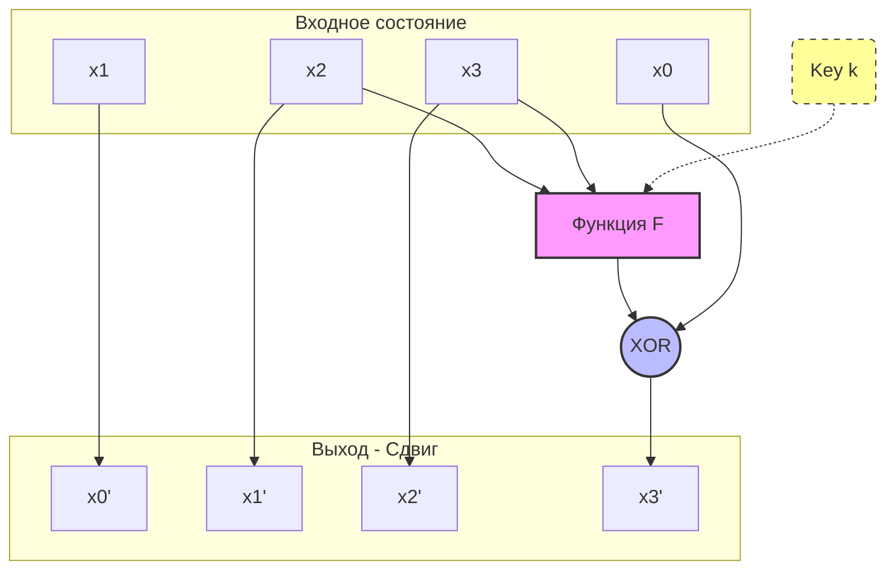
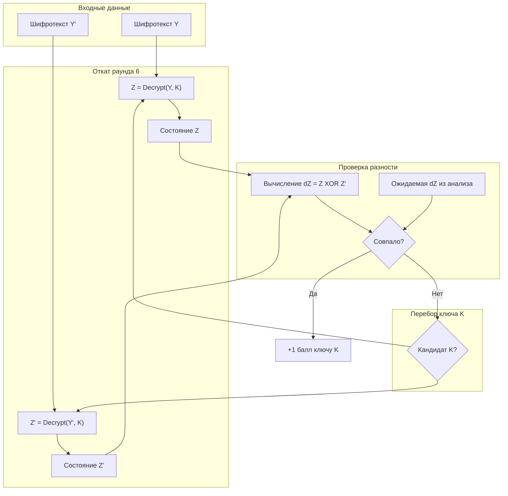

# Криптоанализ шифра GFN-16 (Вариант 5)

Этот репозиторий содержит C++ фреймворк для проведения **Дифференциального криптоанализа** легковесного 16-битного блочного шифра (архитектура "Вариант 5").

Проект демонстрирует полный цикл атаки: от генерации данных и поиска статистических отличителей (дифференциалов) до восстановления секретного ключа последнего раунда.

## 🔐 Архитектура Шифра (Вариант 5)

Целевой шифр представляет собой **Обобщенная сеть Фейстеля (Type-2 GFN)**.

*   **Размер блока:** 16 бит (разбиты на 4 ниббла по 4 бита: $x_0, x_1, x_2, x_3$).
*   **Ключ:** Расписание ключей состоит из 6 раундовых ключей ($k_1 … k_6$), каждый по 4 бита.
*   **Количество раундов:** 6.
*   **S-Box (Таблица подстановки):**
    `{13, 6, 0, 10, 15, 7, 14, 11, 9, 1, 5, 3, 4, 12, 8, 2}`

### Схема раунда

В каждом раунде состояние обновляется следующим образом:

1.  Вычисляется функция раунда $F$ от двух нибблов ($x_2, x_3$) и ключа $k$.
2.  Результат $F$ складывается (XOR) с первым нибблом $x_0$.
3.  Происходит циклический сдвиг всего вектора влево.

**Математическое описание:**
$$\temp = x_0 ⊕ F(x_2, x_3, k)$$
$$x_{new} = (x_1, \ x_2, \ x_3, \ temp)$$

**Функция F:**
$$F(a, b, k) = G(a ⊕ G(k ⊕ b))$$ 
*, где G — операция замены через S-Box.*

**ASCII-схема одного раунда:**



---

## 📂 Структура Проекта

Проект разделен на логические модули:

### 1. Ядро (`include/cipher_engine.h`)
Единый заголовочный файл, содержащий определение `Block`, S-Box, и функции `encrypt`/`decryptOneRound`.

### 2. Дифференциальный анализ (`src/differential/`)
*   `generator_of_data.cpp`: Создает пары $(P, P \oplus \Delta)$ для атаки Chosen Plaintext.
*   `analysis_attack.cpp`: Ищет лучшие дифференциальные характеристики $\Delta P \to \Delta C$.
*   `attack_last_round.cpp`: Восстанавливает ключ методом "отката" последнего раунда.

### 3. Линейный анализ (`src/linear/`)
*   `linear_search.cpp`: Ищет лучшие линейные маски $\alpha \cdot P \oplus \beta \cdot C = 0$.
*   `generator_linear.cpp`: Генерирует массив пар $(P, C)$ (Known Plaintext).
*   `attack_linear.cpp`: Восстанавливает ключ по методу Мацуи №2.

---

## 🛠 Методика Атаки (Key Recovery)

Атака восстанавливает ключ последнего (6-го) раунда, используя статистическую уязвимость, найденную для 5 раундов.

### Логика работы
1.  **Поиск аномалии:** Анализатор находит такую входную разность $\Delta X$, которая после 5 раундов с высокой вероятностью (например, 25%) превращается в конкретную выходную разность $\Delta Y_{target}$.
2.  **Снятие слоя:** Мы имеем пары шифротекстов после 6 раундов ($C, C'$). Если мы угадаем верный ключ 6-го раунда $K_6$, мы сможем "откатить" шифрование на один шаг назад и получить состояния после 5 раундов ($Z, Z'$).
3.  **Проверка гипотезы:** 
    *   Если $K_6$ верен, то разность $Z \oplus Z'$ часто будет совпадать с $\Delta Y_{target}$.
    *   Если $K_6$ неверен, разность будет случайной и совпадать с целью крайне редко.

### Схема алгоритма атаки



---

## 📉 Линейный Криптоанализ

В дополнение к дифференциальному, проект реализует **Линейный криптоанализ**.

### Принцип работы
Метод ищет линейную зависимость между битами открытого текста и битами данных после 5-го раунда:
$$ \alpha \cdot P \oplus \beta \cdot C_5 = 0 $$
где операция "$\cdot$" — скалярное произведение битов (четность).

### Этапы
1.  **Поиск:** Перебор масок $(\alpha, \beta)$ для нахождения максимального смещения (Bias).
2.  **Сбор данных:** Генерация множества случайных пар "текст-шифротекст" (Known Plaintext Attack).
3.  **Атака:** Перебор ключа $K_6$. Для каждого кандидата мы частично дешифруем 6-й раунд и проверяем, выполняется ли линейное уравнение. Ключ с максимальным смещением считается верным.

---

## 🚀 Сборка и Запуск

### Требования
*   Компилятор C++ с поддержкой C++17 (например, `g++`).
*   Утилита `make`.

### Сборка
Для компиляции всех инструментов выполните команду:
```bash
make
```

### Запуск атак

**1. Дифференциальная атака:**
```bash
make run_diff
```
*Запускает цепочку: генерация пар -> поиск дифференциалов -> атака.*

**2. Линейная атака:**
```bash
make run_linear
```
*Запускает цепочку: поиск масок -> генерация данных -> атака.*

### Ручное использование

1.  **Генерация:** `./generator` или `./generator_linear`
2.  **Анализ:** `./analysis` или `./linear_search`
3.  **Атака:** `./attack` или `./attack_linear`

---

## 📊 Результаты

В ходе тестирования (на фиксированных ключах, заданных в `cipher_engine.h`) атака успешно восстанавливает ключ последнего раунда.

Пример вывода атаки:
```text
Target dX: 9 4 12 0
Target dY: 0 0 0 2
... 
Top Key Candidates:
Key = 11 (b) | Hits: 16  <-- Истинный ключ
Key = 9 (9)  | Hits: 16  <-- Ложное срабатывание (призрак), фильтруется дополнительными парами
...
```

## 📄 Лицензия
Проект открыт для изучения и образовательных целей.