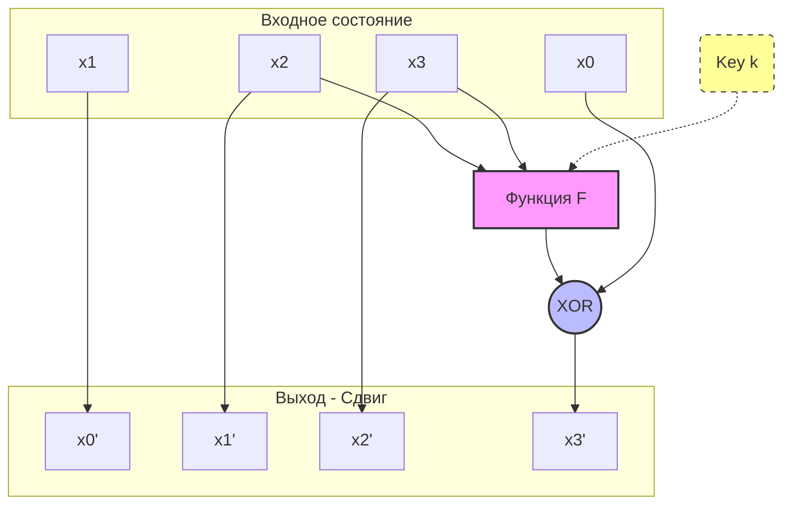
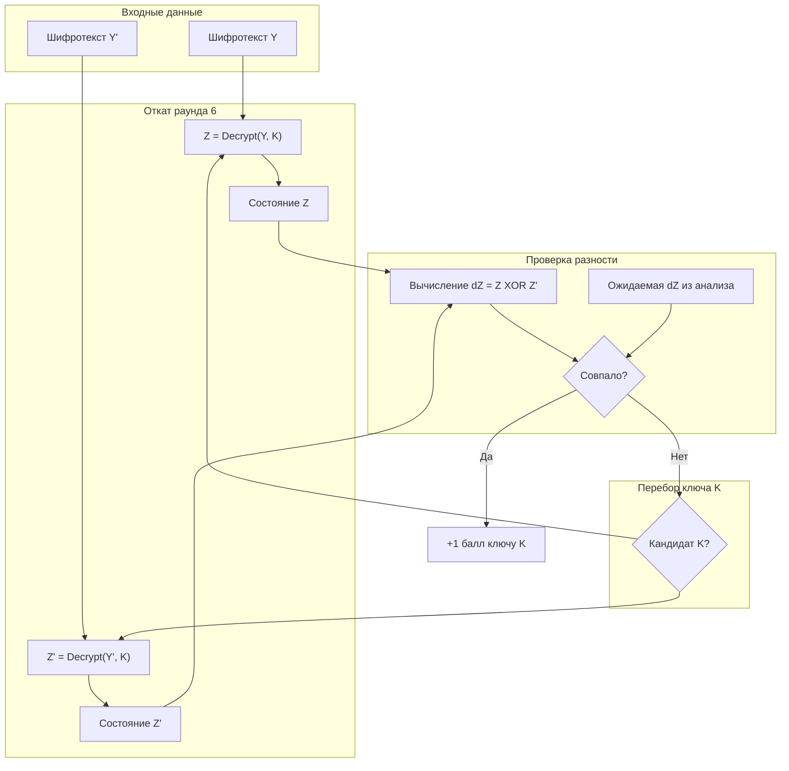

# Криптоанализ шифра GFN-16 (Вариант 5)

Этот репозиторий содержит C++ фреймворк для проведения **Дифференциального криптоанализа** легковесного 16-битного блочного шифра (архитектура "Вариант 5").

Проект демонстрирует полный цикл атаки: от генерации данных и поиска статистических отличителей (дифференциалов) до восстановления секретного ключа последнего раунда.

## 🔐 Архитектура Шифра (Вариант 5)

Целевой шифр представляет собой **Обобщенная сеть Фейстеля (Type-2 GFN)**.

*   **Размер блока:** 16 бит (разбиты на 4 ниббла по 4 бита: $x_0, x_1, x_2, x_3$).
*   **Ключ:** Расписание ключей состоит из 6 раундовых ключей ($k_1 … k_6$), каждый по 4 бита.
*   **Количество раундов:** 6.
*   **S-Box (Таблица подстановки):**
    `{13, 6, 0, 10, 15, 7, 14, 11, 9, 1, 5, 3, 4, 12, 8, 2}`

### Схема раунда

В каждом раунде состояние обновляется следующим образом:

1.  Вычисляется функция раунда $F$ от двух нибблов ($x_2, x_3$) и ключа $k$.
2.  Результат $F$ складывается (XOR) с первым нибблом $x_0$.
3.  Происходит циклический сдвиг всего вектора влево.

**Математическое описание:**
$$\temp = x_0 ⊕ F(x_2, x_3, k)$$
$$x_{new} = (x_1, \ x_2, \ x_3, \ temp)$$

**Функция F:**
$$F(a, b, k) = G(a ⊕ G(k ⊕ b))$$ 
*, где G — операция замены через S-Box.*

**ASCII-схема одного раунда:**



---

## 📂 Структура Проекта

Проект состоит из трех модулей, использующих общее криптографическое ядро.

### 1. Ядро (`cipher_engine.h`)
Единый заголовочный файл, содержащий:
*   Определения структур данных (`Block`).
*   Константы (S-Box, тестовые ключи).
*   Реализацию шифрования (`encrypt`) и частичного дешифрования (`decryptOneRound`).

### 2. Генератор данных (`generator_of_data.cpp`)
Создает пары "открытый текст — шифротекст" для анализа.
*   Перебирает базовые тексты и накладывает на них все возможные входные разности (65536 вариантов).
*   Формирует файл `pairs_data.txt` (~150 МБ), содержащий пары $(X, \Delta X, Y, Y')$.

### 3. Дифференциальный Анализатор (`analysis_attack.cpp`)
Ищет уязвимости (дифференциальные характеристики).
*   Симулирует прохождение разностей через **5 раундов** шифра.
*   Строит таблицу частот переходов $\Delta X \to \Delta Y$.
*   Сохраняет лучшие найденные характеристики в `diff_round_5_top.txt`.

### 4. Атака на ключ (`attack_last_round.cpp`)
Восстанавливает ключ 6-го раунда.
*   Фильтрует пары шифротекстов, соответствующие лучшей найденной разности $\Delta X$.
*   Перебирает все возможные варианты последнего ключа ($2^4 = 16$ вариантов).
*   Для каждого кандидата делает "откат" на один раунд назад и проверяет, совпадает ли полученная разность с ожидаемой $\Delta Y$ (из этапа анализа).
*   Результат записывается в `last_round_key_guess.txt`.

---

## 🛠 Методика Атаки (Key Recovery)

Атака восстанавливает ключ последнего (6-го) раунда, используя статистическую уязвимость, найденную для 5 раундов.

### Логика работы
1.  **Поиск аномалии:** Анализатор находит такую входную разность $\Delta X$, которая после 5 раундов с высокой вероятностью (например, 25%) превращается в конкретную выходную разность $\Delta Y_{target}$.
2.  **Снятие слоя:** Мы имеем пары шифротекстов после 6 раундов ($C, C'$). Если мы угадаем верный ключ 6-го раунда $K_6$, мы сможем "откатить" шифрование на один шаг назад и получить состояния после 5 раундов ($Z, Z'$).
3.  **Проверка гипотезы:** 
    *   Если $K_6$ верен, то разность $Z \oplus Z'$ часто будет совпадать с $\Delta Y_{target}$.
    *   Если $K_6$ неверен, разность будет случайной и совпадать с целью крайне редко.

### Схема алгоритма атаки



---

## 🚀 Сборка и Запуск

### Требования
*   Компилятор C++ с поддержкой C++17 (например, `g++`).
*   Утилита `make`.

### Сборка
Для компиляции всех инструментов выполните команду:
```bash
make
```

### Автоматический тест
Запустить полный цикл (Генерация -> Анализ -> Атака):
```bash
make run_test
```

### Пошаговое использование

1.  **Генерация:**
    ```bash
    ./generator
    ```
2.  **Анализ:**
    ```bash
    ./analysis
    ```
    *Результат будет в файле `diff_round_5_top.txt`. Программа автоматически сортирует дифференциалы по вероятности.*
3.  **Атака:**
    ```bash
    ./attack
    ```
    *Программа выведет список кандидатов ключа, отсортированный по количеству совпадений ("Hits").*

---

## 📊 Результаты

В ходе тестирования (на фиксированных ключах, заданных в `cipher_engine.h`) атака успешно восстанавливает ключ последнего раунда.

Пример вывода атаки:
```text
Target dX: 9 4 12 0
Target dY: 0 0 0 2
... 
Top Key Candidates:
Key = 11 (b) | Hits: 16  <-- Истинный ключ
Key = 9 (9)  | Hits: 16  <-- Ложное срабатывание (призрак), фильтруется дополнительными парами
...
```

## 📄 Лицензия
Проект открыт для изучения и образовательных целей.